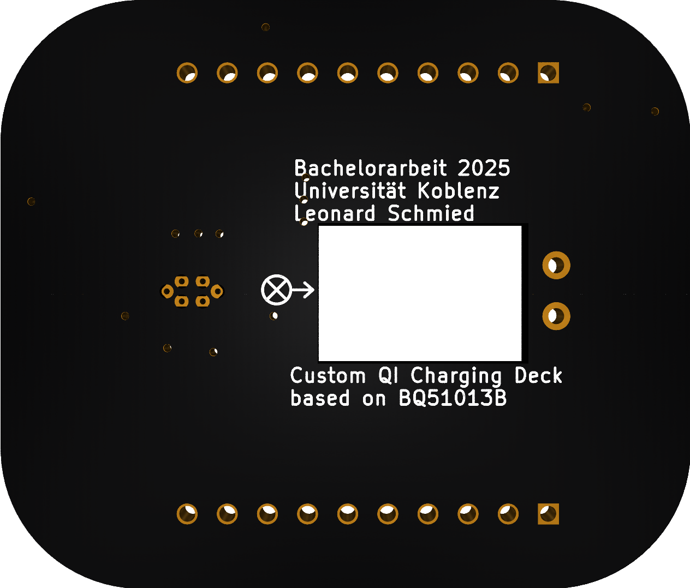

# README — Crazyflie „Custom-Qi-Deck“ (DE/EN)

> **Kurzbeschreibung.** Dieses Repository bündelt alle Artefakte der Bachelorarbeit zur Entwicklung eines *Custom-Qi-Decks* für die Crazyflie-Plattform, inklusive Elektronik (PCB), Mechanik (3D-Druck), Firmware und Skripten. Das Deck nutzt die **1-Wire-Deck-Identifikation** der Crazyflie 2.x, sodass beim Booten automatisch der passende Treiber geladen wird. Ohne beschriebene *Deck-EEPROM/One-Wire-Memory* stoppt die Drohne den Bootvorgang, bei nicht korrekt beschriebenem Speicher lädt die Drohne den Treiber nicht, weshalb die nachfolgenden Schritte zur EEPROM-Programmierung obligatorisch sind, um eine korrekte Funktionalität des Gesamtsystems zu gewährleisten. ([Bitcraze][1])

---

## 🇩🇪 Deutsch

### 1. Projektüberblick und Repository-Struktur

Die Ordnerstruktur ist bewusst so gewählt, dass Einsteigerinnen und Einsteiger schnell handlungsfähig werden:

```
bachelor-thesis/
├── README.md
├── LICENSE
├── docs/
│   ├── thesis/                # Thesis-Quellen (LaTeX/Word)
│   ├── figures/               # Abbildungen
│   └── presentations/         # Foliensätze
├── software/
│   ├── stm32-firmware/        # Crazyflie-STM32-Firmware
│   ├── nrf-firmware/          # NRF51-Firmware
│   ├── python-scripts/        # Tools, Analyse, Kontrolle
│   └── shared-libraries/      # Gemeinsame Bibliotheken
├── hardware/
│   ├── kicad-project/         # KiCad (.sch, .kicad_pcb, ...)
│   ├── fabrication-files/     # Gerber, BoM, Pick&Place
│   └── images/                # Fotos PCB/Bestückung
├── mechanics/
│   ├── cad-models/            # STEP/STL/Fusion
│   ├── animations/            # Render/Simulation
│   ├── images/                # Renders/Exploded Views
│   └── videos/                # Demo-/Montagevideos
└── experiments/
    ├── flight-tests/
    ├── sensor-logs/
    └── analysis/
```

---

### 2. Voraussetzungen (kurz)

* **Hardware:** Crazyflie 2.x + Radio (Crazyradio PA), Flow-Deck & Multi-ranger (optional, je nach Versuch), *Custom-Qi-Deck* (dieses Projekt).
* **Software:** Python 3.10+, `cflib` (Crazyflie Python Library), Crazyflie Client (optional für Konsole/Log-Ansicht).
* **Werkzeuge:** KiCad (für Anpassungen), gängige PCB-Bestückungsausrüstung.

---

### 3. PCB bestellen und bestücken

**3.1 Fertigungsdateien verwenden.** Im Ordner `hardware/fabrication-files/` liegen **Gerber-Daten**, **BoM** (Stückliste) und **Pick-and-Place**-Dateien. Diese sind bei üblichen PCB-Fertigern direkt hochladbar.

> *Hinweis:* Die Crazyflie-Decks werden über die 2×5-Stiftleisten und einen **1-Wire-Memory-Chip** identifiziert, der auf dem PCB bestückt sein muss (siehe Abschnitt 4). ([Bitcraze][1])

**3.2 BoM (Stückliste).** Die BoM enthält **alle** Bauteile zur vollständigen Bestückung, inkl. des 1-Wire-Memorys. Prüfen Sie vor Bestellung die Gehäuseformen und Lötpads.

**3.3 Kurze Montageanleitung.** (Angelehnt an die Thesis-Montagekapitel)

1. **Vorbereitung:** Leiterplatte reinigen; Bauteile gemäß BoM bereitstellen.
2. **Kleinteile (SMD) löten:** Zuerst passiv, dann ICs; besonders sauber: Qi-Empfänger, Gleichrichter/Power-Path, **1-Wire-Memory**.
3. **Verbinder setzen:** Headerleisten (2×10) exakt rechtwinklig.
4. **Mechanik prüfen:** Deckform und ggf. 3D-gedruckte Führung/„Ladetrichter“ aus `mechanics/cad-models/` kontrollieren und anpassen.
5. **Sichtprüfung & Reinigung:** Kurzschlussprüfung, Flussmittelreste entfernen.

> *Die Crazyflie liest am Start alle 1-Wire-Memories der Decks und initialisiert deren Treiber. Ein leeres/fehlerhaftes Deck-Memory kann das Starten verhindern oder die Funktionalität der anderen Decks, insbesondere dem Flowdeck, beeinflussen
> .* ([Bitcraze][1])

*Vorschau-Bilder:*

 



---

### 4. **Obligatorisch:** EEPROM/One-Wire-Memory programmieren

**Ziel.** Das Deck-EEPROM enthält Identitätsdaten (Vendor/Produkt/Name/Version), die der Crazyflie-Firmware erlauben, **Kompatibilität zu prüfen** und den **Treiber automatisch zu laden** (*Deck Enumeration*). ([Bitcraze][1])

**Werkzeuge.** Bitcraze stellt CRTP-basierte *Memory-Access*-Funktionen sowie Beispielskripte zum **Lesen/Schreiben des 1-Wire-Speichers** bereit (z. B. `read-ow.py`/`write-ow.py` in der Crazyflie-Python-Bibliothek). ([Bitcraze][2])

**Vorgehen (empfohlen):**

1. Crazyflie einschalten; per Radio verbinden.
2. Skript `write-ow.py` (oder eigenes Tool) verwenden, um das Deck-Memory zu beschreiben.
3. Reboot; Konsole prüfen (siehe **Validierung**).

**⚠️ WICHTIG:** Ohne korrekt geschriebenes EEPROM kann die Bootsequenz abbrechen bzw. der Treiber wird nicht geladen. ([Bitcraze][1])

**Platzhalter für Python-Code (anpassbar):**

```python
# replace method with this data:
    def _connected(self, link_uri):
        """ This callback is called form the Crazyflie API when a Crazyflie
        has been connected and the TOCs have been downloaded."""
        print('Connected to %s' % link_uri)

        mems = self._cf.mem.get_mems(MemoryElement.TYPE_1W)
        print('Found {} 1-wire memories'.format(len(mems)))
        if len(mems) > 0:
            print('Writing test configuration to'
                  ' memory {}'.format(mems[0].id))

            deck_name = 'custom_qi'

            # Setting VID:PID to 00:00 will make the Crazyflie match driver to the board name
            mems[0].vid = 0x00 #0xBC
            mems[0].pid = 0x00 #0x0F
            mems[0].pins = 0x0C #0x0C
            mems[0].name = deck_name
            mems[0].valid = True

            board_name_id = OWElement.element_mapping[1]
            board_rev_id = OWElement.element_mapping[2]

            mems[0].elements[board_name_id] = deck_name
            mems[0].elements[board_rev_id] = 'A'

            mems[0].write_data(self._data_written)
# TODO: Mit cflib examples/memory/write-ow.py an Deck schreiben.
```

> *Hinweis:* Details zum **Deck-Memory-Format** und zur **Memory-API** finden sich in der offiziellen Dokumentation. Stimmen Sie Felder und Prüfsummen mit dem verwendeten Tooling ab. ([Bitcraze][3])

---

### 5. Validierung (Konsole/Boot-Logs)

Nach dem Neustart sollte die Crazyflie in der **Konsole** (Crazyflie-Client) ausgeben, dass ein Deck-Memory gefunden wurde und der passende Treiber geladen ist. Suchen Sie nach Mustern wie:

```
SYS: Deck OW memory detected
DECK: found "Custom Qi Deck"
DECK: loading driver "custom_qi_deck" ... OK
```

> *Je nach Firmwareversion variieren die Strings leicht; entscheidend ist die Erkennung des Deck-Namens und das Laden des Treibers.* (Hintergrund: Deck-Enumeration via 1-Wire/MEM-Subsystem.) ([Bitcraze][1])

---

### 6. Sicherheitshinweis (USB)

> **Achtung – USB nicht verwenden!**
> Solange das **Custom-Qi-Deck aufgesteckt und aktiv verwendet** wird, **darf die USB-Schnittstelle der Crazyflie nicht genutzt** werden. Anderenfalls können **Fehlfunktionen** (u. a. in der Strompfad-Umschaltung) auftreten.

---

### 7. Wall-Follow-Demo

> **Hinweis:** Im Ordner `experiments/flight-tests/` finden Sie Aufzeichnungen zur Wall-Follow-Demo mit dem Custom-Qi-Deck. Diese Demo nutzt den Multi-Ranger-Sensor zur Abstandsmessung und zeigt die Flugstabilität mit dem neuen Deck.

Für die Wall-Follow-Demo wurde ein einfacher PID-Regler implementiert, der die seitlichen Abstände zum Hindernis misst und die Position der Crazyflie entsprechend anpasst. Anschließend landet die Drohne sicher auf der Qi-Ladestation in einer vordefinierten Position.
Nach einer kurzen Ladephase hebt die Drohne wieder ab und fliegt weiter an der Wand entlang, indem sie zu dem Initialzustand der FSM zurückkehrt. Die folgende Abbildung zeigt den schematischen Ablauf der Wall-Follow-Demo:


### 8. Software/Firmware (kurz)

* **STM32/NRF-Firmware:** Quellen unter `software/stm32-firmware/` und `software/nrf-firmware/`.
* **Deck-Treiber:** Ein eigener Treiber wird beim Booten anhand des Deck-Memorys geladen (siehe Doku zur Deck-API/How-To für Deck-Treiber). ([Bitcraze][4])
* **Python-Skripte:** In `software/python-scripts/` liegen Hilfs- und Validierungs-Skripte (Logging, Wall-Following-Demos etc.).

---

### 9. Referenzen

* Bitcraze: **Expansion board detection** (1-Wire-Memory, Boot-Ablauf). ([Bitcraze][1])
* Bitcraze: **Deck memory format** (Aufbau/CRC, Zweck). ([Bitcraze][3])
* Bitcraze: **CRTP Memory access** (Lesen/Schreiben von 1-Wire-Memories). ([Bitcraze][2])
* Bitcraze Forum: **read-ow.py / write-ow.py** (Beispiele). ([forum.bitcraze.io][5])
* Bitcraze: **Expansion-Template (KiCad)** (Design-Startpunkt). ([GitHub][6])

---

## 🇬🇧 English

### 1. Project overview & repository layout

This repository contains the full pipeline for a *Custom Qi Charging Deck* for the Crazyflie: electronics (PCB), mechanics (3D-printed parts), firmware and Python tools. Crazyflie 2.x relies on a **1-Wire deck memory** to enumerate installed decks at boot; the correct deck driver is loaded automatically *only if* the deck’s EEPROM is programmed properly. Otherwise the system may refuse to start or the driver will not load. ([Bitcraze][1])

(See the directory tree above for a quick orientation.)

---

### 2. Prerequisites (quick)

* **Hardware:** Crazyflie 2.x + Crazyradio PA, Flow-deck (optional), Multi-ranger (optional) and *Custom-Qi-Deck* (this project).
* **Software:** Python 3.10+, `cflib` (Crazyflie Python Library), Crazyflie Client (optional).
* **Tools:** KiCad, standard PCB assembly tooling.

---

### 3. PCB fabrication & assembly

**3.1 Order the PCB.** Upload the **Gerber**, **BoM** and **Pick-and-Place** files from `hardware/fabrication-files/` to your preferred PCB/assembly vendor.
**3.2 Bill of Materials.** The BoM lists **all** components required to fully assemble the deck, including the **1-Wire memory** for deck identification.
**3.3 Short assembly guide.**

1. **Prep:** Clean PCB; stage components per BoM.
2. **SMD first:** passives → ICs; pay attention to Qi receiver, rectifier/power path, **1-Wire memory**.
3. **Headers:** Solder 2×5 connectors exactly orthogonal.
4. **Mechanics:** Verify fit with printed guides/funnel from `mechanics/cad-models/`.
5. **Inspection:** Shorts/opens, clean flux residues.

> *Explanation:* At boot, the Crazyflie’s nRF MCU scans all deck **1-Wire memories** and the application initializes drivers accordingly. An empty/invalid deck memory can block startup. ([Bitcraze][1])

---

### 4. **Mandatory:** Program the deck EEPROM (1-Wire)

**Purpose.** The deck-EEPROM stores identity data (vendor/product/name/version) so the firmware can **verify compatibility** and **auto-load the proper driver** (*deck enumeration*). ([Bitcraze][1])

**Tools.** Use Bitcraze’s CRTP **memory access** and example scripts (`read-ow.py` / `write-ow.py`) from the Crazyflie Python library to **read/write** the deck’s 1-Wire memory. ([Bitcraze][2])

**Procedure.**

1. Power Crazyflie; connect via radio.
2. Use `write-ow.py` (or your own script) to program the deck memory.
3. Reboot and verify (see **Validation**).

**⚠️ IMPORTANT:** If you skip this step, the Crazyflie may not boot properly and the custom Qi driver will not load. ([Bitcraze][1])

**Placeholder Python snippet (edit your IDs):**

```python
# replace method with this data:
    def _connected(self, link_uri):
        """ This callback is called form the Crazyflie API when a Crazyflie
        has been connected and the TOCs have been downloaded."""
        print('Connected to %s' % link_uri)

        mems = self._cf.mem.get_mems(MemoryElement.TYPE_1W)
        print('Found {} 1-wire memories'.format(len(mems)))
        if len(mems) > 0:
            print('Writing test configuration to'
                  ' memory {}'.format(mems[0].id))

            deck_name = 'custom_qi'

            # Setting VID:PID to 00:00 will make the Crazyflie match driver to the board name
            mems[0].vid = 0x00 #0xBC
            mems[0].pid = 0x00 #0x0F
            mems[0].pins = 0x0C #0x0C
            mems[0].name = deck_name
            mems[0].valid = True

            board_name_id = OWElement.element_mapping[1]
            board_rev_id = OWElement.element_mapping[2]

            mems[0].elements[board_name_id] = deck_name
            mems[0].elements[board_rev_id] = 'A'

            mems[0].write_data(self._data_written)
# TODO: write DECK_INFO to the deck 1-Wire memory using cflib or write-ow.py
```

> *For the exact memory layout and checksums, consult the official docs and align with the tooling you use.* ([Bitcraze][3])

---

### 5. Validation (console/boot logs)

After rebooting, check the **console** in the Crazyflie client. You should see that the deck memory was found and the **custom Qi driver** loaded, e.g.:

```
SYS: Deck OW memory detected
DECK: found "Custom Qi Deck"
DECK: loading driver "custom_qi_deck" ... OK
```

> *Exact messages vary by firmware; look for deck discovery and driver initialization.* (Background: 1-Wire deck enumeration and MEM subsystem.) ([Bitcraze][1])

---

### 6. Safety notice (USB)

> **Do not use USB while the Custom-Qi-Deck is attached and in use.**
> Using the USB port concurrently can lead to **malfunctions** (power path conflicts).

---

### 7. Software/Firmware (short)

* **STM32/NRF firmware:** see `software/stm32-firmware/` and `software/nrf-firmware/`.
* **Deck driver:** Your custom driver is auto-loaded at boot based on the deck memory (see Deck API / driver how-to). ([Bitcraze][4])
* **Python scripts:** tooling and validation in `software/python-scripts/`.

---

### License

Siehe `LICENSE`. Bitte zitieren/attribuieren Sie die verwendeten Bitcraze-Ressourcen gemäß deren Lizenzen/Guidelines. Vorlage/Template-Elektronik siehe Bitcraze-Projekt. ([GitHub][6])

---

> **Hinweis zur Reproduzierbarkeit:** Für die elektrische Deck-Erkennung und das automatische Treiber-Laden sind das **1-Wire-Deck-Memory** und dessen **korrekter Inhalt** zentral. Prüfen Sie nach jeder Hardware-Änderung das Boot-Log. Die technische Funktionsweise ist in der offiziellen Dokumentation detailliert beschrieben. ([Bitcraze][1])

[1]: https://www.bitcraze.io/documentation/system/platform/cf2-expansiondecks/ "Expansion decks of the Crazyflie 2.x"
[2]: https://www.bitcraze.io/documentation/repository/crazyflie-firmware/master/functional-areas/crtp/crtp_mem/ "Memory access"
[3]: https://www.bitcraze.io/documentation/repository/crazyflie-firmware/master/functional-areas/deck_memory_format/ "Deck memory format"
[4]: https://www.bitcraze.io/documentation/repository/crazyflie-firmware/master/userguides/deck/ "Deck API"
[5]: https://forum.bitcraze.io/viewtopic.php?t=5105 "Where to see OW memory content?"
[6]: https://github.com/bitcraze/crazyflie2-exp-template-electronics "KiCad project for the Crazyflie 2.0 expansion template"
