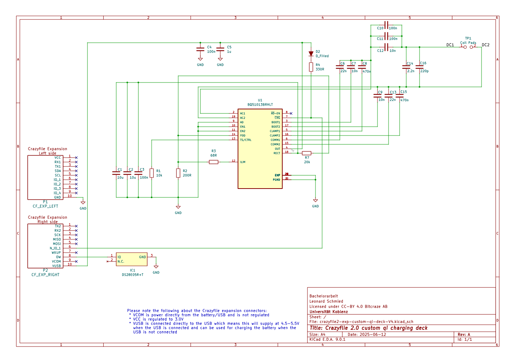

# README — Crazyflie „Custom-Qi-Deck“ (DE/EN)

> **Kurzbeschreibung.** Dieses Repository bündelt alle Artefakte der Bachelorarbeit zur Entwicklung eines *Custom-Qi-Decks* für die Crazyflie-Plattform, inklusive Elektronik (PCB), Mechanik (3D-Druck), Firmware und Skripten. Das Deck nutzt die **1-Wire-Deck-Identifikation** der Crazyflie 2.x, sodass beim Booten automatisch der passende Treiber geladen wird. Ohne beschriebene *Deck-EEPROM/One-Wire-Memory* stoppt die Drohne den Bootvorgang, bei nicht korrekt beschriebenem Speicher lädt die Drohne den Treiber nicht, weshalb die nachfolgenden Schritte zur EEPROM-Programmierung obligatorisch sind, um eine korrekte Funktionalität des Gesamtsystems zu gewährleisten. ([Bitcraze][1])

---

## 🇩🇪 Deutsch

### 1. Projektüberblick und Repository-Struktur

Die Ordnerstruktur ist bewusst so gewählt, dass Einsteigerinnen und Einsteiger schnell handlungsfähig werden:

```
bachelor-thesis/
├── README.md
├── LICENSE
├── docs/
│   ├── thesis/                # Thesis-Quellen (LaTeX/Word)
│   ├── figures/               # Abbildungen
│   └── presentations/         # Foliensätze
├── software/
│   ├── stm32-firmware/        # Crazyflie-STM32-Firmware
│   ├── nrf-firmware/          # NRF51-Firmware
│   ├── python-scripts/        # Tools, Analyse, Kontrolle
│   └── shared-libraries/      # Gemeinsame Bibliotheken
├── hardware/
│   ├── kicad-project/         # KiCad (.sch, .kicad_pcb, ...)
│   ├── fabrication-files/     # Gerber, BoM, Pick&Place
│   └── images/                # Fotos PCB/Bestückung
├── mechanics/
│   ├── cad-models/            # STEP/STL/Fusion
│   ├── animations/            # Render/Simulation
│   ├── images/                # Renders/Exploded Views
│   └── videos/                # Demo-/Montagevideos
└── experiments/
    ├── flight-tests/
    ├── sensor-logs/
    └── analysis/
```

---

### 2. Voraussetzungen (kurz)

* **Hardware:** Crazyflie 2.x + Radio (Crazyradio PA), Flow-Deck & Multi-ranger (optional, je nach Versuch), *Custom-Qi-Deck* (dieses Projekt).
* **Software:** Python 3.10+, `cflib` (Crazyflie Python Library), Crazyflie Client (optional für Konsole/Log-Ansicht).
* **Werkzeuge:** KiCad (für Anpassungen), gängige PCB-Bestückungsausrüstung.

---

### 3. PCB bestellen und bestücken

**3.1 Fertigungsdateien verwenden.** Im Ordner `hardware/fabrication-files/` liegen **Gerber-Daten**, **BoM** (Stückliste) und **Pick-and-Place**-Dateien. Diese sind bei üblichen PCB-Fertigern direkt hochladbar.

> *Hinweis:* Die Crazyflie-Decks werden über die 2×5-Stiftleisten und einen **1-Wire-Memory-Chip** identifiziert, der auf dem PCB bestückt sein muss (siehe Abschnitt 4). ([Bitcraze][1])

**3.2 BoM (Stückliste).** Die BoM enthält **alle** Bauteile zur vollständigen Bestückung, inkl. des 1-Wire-Memorys. Prüfen Sie vor Bestellung die Gehäuseformen und Lötpads.

**3.3 Kurze Montageanleitung.** (Angelehnt an die Thesis-Montagekapitel)

1. **Vorbereitung:** Leiterplatte reinigen; Bauteile gemäß BoM bereitstellen.
2. **Kleinteile (SMD) löten:** Zuerst passiv, dann ICs; besonders sauber: Qi-Empfänger, Gleichrichter/Power-Path, **1-Wire-Memory**.
3. **Verbinder setzen:** Headerleisten (2×10) exakt rechtwinklig.
4. **Mechanik prüfen:** Deckform und ggf. 3D-gedruckte Führung/„Ladetrichter“ aus `mechanics/cad-models/` kontrollieren und anpassen.
5. **Sichtprüfung & Reinigung:** Kurzschlussprüfung, Flussmittelreste entfernen.

> *Die Crazyflie liest am Start alle 1-Wire-Memories der Decks und initialisiert deren Treiber. Ein leeres/fehlerhaftes Deck-Memory kann das Starten verhindern oder die Funktionalität der anderen Decks, insbesondere dem Flowdeck, beeinflussen
> .* ([Bitcraze][1])

*Vorschau-Bilder:*

 




---

### 4. **Obligatorisch:** EEPROM/One-Wire-Memory programmieren

**Ziel.** Das Deck-EEPROM enthält Identitätsdaten (Vendor/Produkt/Name/Version), die der Crazyflie-Firmware erlauben, **Kompatibilität zu prüfen** und den **Treiber automatisch zu laden** (*Deck Enumeration*). ([Bitcraze][1])

**Werkzeuge.** Bitcraze stellt CRTP-basierte *Memory-Access*-Funktionen sowie Beispielskripte zum **Lesen/Schreiben des 1-Wire-Speichers** bereit (z. B. `read-ow.py`/`write-ow.py` in der Crazyflie-Python-Bibliothek). ([Bitcraze][2])

**Vorgehen (empfohlen):**

1. Crazyflie einschalten; per Radio verbinden.
2. Skript `write-ow.py` (oder eigenes Tool) verwenden, um das Deck-Memory zu beschreiben.
3. Reboot; Konsole prüfen (siehe **Validierung**).

**⚠️ WICHTIG:** Ohne korrekt geschriebenes EEPROM kann die Bootsequenz abbrechen bzw. der Treiber wird nicht geladen. ([Bitcraze][1])

**Platzhalter für Python-Code (anpassbar):**

```python
# replace method with this data:
    def _connected(self, link_uri):
        """ This callback is called form the Crazyflie API when a Crazyflie
        has been connected and the TOCs have been downloaded."""
        print('Connected to %s' % link_uri)

        mems = self._cf.mem.get_mems(MemoryElement.TYPE_1W)
        print('Found {} 1-wire memories'.format(len(mems)))
        if len(mems) > 0:
            print('Writing test configuration to'
                  ' memory {}'.format(mems[0].id))

            deck_name = 'custom_qi'

            # Setting VID:PID to 00:00 will make the Crazyflie match driver to the board name
            mems[0].vid = 0x00 #0xBC
            mems[0].pid = 0x00 #0x0F
            mems[0].pins = 0x0C #0x0C
            mems[0].name = deck_name
            mems[0].valid = True

            board_name_id = OWElement.element_mapping[1]
            board_rev_id = OWElement.element_mapping[2]

            mems[0].elements[board_name_id] = deck_name
            mems[0].elements[board_rev_id] = 'A'

            mems[0].write_data(self._data_written)
# TODO: Mit cflib examples/memory/write-ow.py an Deck schreiben.
```

> *Hinweis:* Details zum **Deck-Memory-Format** und zur **Memory-API** finden sich in der offiziellen Dokumentation. Stimmen Sie Felder und Prüfsummen mit dem verwendeten Tooling ab. ([Bitcraze][3])

---

### 5. Validierung (Konsole/Boot-Logs)

Nach dem Neustart sollte die Crazyflie in der **Konsole** (Crazyflie-Client) ausgeben, dass ein Deck-Memory gefunden wurde und der passende Treiber geladen ist. Suchen Sie nach Mustern wie:

```
...
DECK_CORE: 3 deck(s) found
DECK_CORE: Calling INIT on driver custom_qi for deck 0
[CUSTOM_QI] driver initialized
DECK_CORE: Calling INIT on driver bcMultiranger for deck 1
[CUSTOM_QI] task started
DECK_CORE: Calling INIT on driver bcFlow2 for deck 2
...
DECK_CORE: Deck 0 test [OK].
...
DECK_CORE: Deck 1 test [OK].
DECK_CORE: Deck 2 test [OK].
SYS: Self test passed!
STAB: Wait for sensor calibration...
SYS: Free heap: 12432 bytes
STAB: Starting stabilizer loop
```

> *Je nach Firmwareversion variieren die Strings leicht; entscheidend ist die Erkennung des Deck-Namens und das Laden des Treibers.* (Hintergrund: Deck-Enumeration via 1-Wire/MEM-Subsystem.) ([Bitcraze][1])

---

### 6. Sicherheitshinweis (USB)

> **Achtung – USB nicht verwenden!**
> Solange das **Custom-Qi-Deck aufgesteckt und aktiv verwendet** wird, **darf die USB-Schnittstelle der Crazyflie nicht genutzt** werden. Anderenfalls können **Fehlfunktionen** (u. a. in der Strompfad-Umschaltung) auftreten.

---

### 7. Wall-Follow-Demo

> **Hinweis:** Im Ordner `experiments/flight-tests/` finden Sie Aufzeichnungen zur Wall-Follow-Demo mit dem Custom-Qi-Deck. Diese Demo nutzt den Multi-Ranger-Sensor zur Abstandsmessung und zeigt die Flugstabilität mit dem neuen Deck.

Für die Wall-Follow-Demo wurde ein einfacher PID-Regler implementiert, der die seitlichen Abstände zum Hindernis misst und die Position der Crazyflie entsprechend anpasst. Anschließend landet die Drohne sicher auf der Qi-Ladestation in einer vordefinierten Position. Nach einer kurzen Ladephase hebt die Drohne wieder ab und fliegt weiter an der Wand entlang, indem sie zu dem Initialzustand der FSM zurückkehrt. Die folgende Abbildung zeigt den schematischen Ablauf der Wall-Follow-Demo:


### 8. Software/Firmware (kurz)

* **STM32/NRF-Firmware:** Quellen unter `software/stm32-firmware/` und `software/nrf-firmware/`.
  * Flashen der Crazyflie-Firmware (STM32, cf2.bin inkl. Custom-Qi-Treiber)
    * Manuell in den Bootloader wechseln (falls nötig). Crazyflie AUS → Power-Taste ~3 s drücken bis die blauen LEDs blinken → dann make cload ausführen.
    * Optional: Über den Crazyflie-Client die Firmware flashen (STM32 + NRF51).
    * In der NRF-Firmware kann optional die Fast-Charging-Funktionalität aktiviert werden, wenn der Treiber geladen ist und die Hardware durch den Prop-Wash kühlt.
* **Deck-Treiber:** Ein eigener Treiber wird beim Booten anhand des Deck-Memorys geladen (siehe Doku zur Deck-API/How-To für Deck-Treiber). ([Bitcraze][4])
* **Python-Skripte:** In `software/python-scripts/` liegen Hilfs- und Validierungs-Skripte (Logging, Wall-Following-Demos etc.).

---

### 9. 3D-Modelle und Mechanik

* **Trichter und Lad-Pad:** die 3D-Modelle für den Ladetrichter und das Qi-Ladepad befinden sich in `mechanics/cad-models/components` (STEP/STL/Fusion).
* **Makerworld:** Die Modelle sind auch auf [Makerworld](https://makerworld.io/) verfügbar: [Qi Charging Kit](https://makerworld.com/de/models/1899630-crazyflie-charging-funnel#profileId-2035758)
  * hier finden Sie auch Anleitungen, fertig sliced Modelle zum 3D-Druck und zur Montage.
* **Qi-Transmitter:** Für den Qi-Sender (Ladestation) wurde ein handelsübliches Modul verwendet (z. B. [Qi Wireless Charger](https://de.aliexpress.com/item/1005007750862678.html)).

---

### 10. Referenzen

* Bitcraze: **Expansion board detection** (1-Wire-Memory, Boot-Ablauf). ([Bitcraze][1])
* Bitcraze: **Deck memory format** (Aufbau/CRC, Zweck). ([Bitcraze][3])
* Bitcraze: **CRTP Memory access** (Lesen/Schreiben von 1-Wire-Memories). ([Bitcraze][2])
* Bitcraze Forum: **read-ow.py / write-ow.py** (Beispiele). ([forum.bitcraze.io][5])
* Bitcraze: **Expansion-Template (KiCad)** (Design-Startpunkt). ([GitHub][6])

---

## 🇬🇧 English

### 1. Project overview & repository layout

This repository bundles all artifacts of the bachelor thesis developing a *Custom-Qi-Deck* for the Crazyflie platform, including electronics (PCB), mechanics (3D printing), firmware and scripts. The deck uses the **1-Wire deck identification** of the Crazyflie 2.x so the appropriate driver is automatically loaded during boot. Without a programmed *deck EEPROM/one-wire memory* the drone may abort the boot process or the driver will not be loaded, therefore the following steps to program the EEPROM are mandatory to ensure correct system functionality. ([Bitcraze][1])

---

### 2. Prerequisites (quick)

* **Hardware:** Crazyflie 2.x + radio (Crazyradio PA), Flow-Deck & Multi-Ranger (optional, depending on experiment), *Custom-Qi-Deck* (this project).
* **Software:** Python 3.10+, `cflib` (Crazyflie Python Library), Crazyflie Client (optional for console/log view).
* **Tools:** KiCad (for modifications), common PCB assembly tooling.

---

### 3. PCB ordering and assembly

**3.1 Use the fabrication files.** The folder `hardware/fabrication-files/` contains **Gerber data**, the **BoM** (bill of materials) and **pick-and-place** files. These can be uploaded directly to typical PCB manufacturers.

> *Note:* Crazyflie expansion decks are identified via the 2×5 pin header and a **1-Wire memory chip** which must be populated on the PCB (see section 4). ([Bitcraze][1])

**3.2 BoM (bill of materials).** The BoM contains **all** components required for full assembly, including the 1-Wire memory. Verify package types and solder pads before ordering.

**3.3 Short assembly guide.** (Based on the thesis assembly chapters)

1. **Preparation:** Clean the PCB; stage components according to the BoM.
2. **SMD first:** solder passives first, then ICs; pay special attention to the Qi receiver, rectifier/power-path, and the **1-Wire memory**.
3. **Place headers:** Ensure the 2×10 pin headers are soldered exactly orthogonal.
4. **Mechanics check:** Verify the deck outline and the optionally 3D-printed guide/"charging funnel" from `mechanics/cad-models/` and adapt if needed.
5. **Inspection & cleaning:** Check for shorts, remove flux residues.

> *The Crazyflie reads all 1-Wire memories of connected decks at startup and initializes their drivers. An empty or invalid deck memory can prevent boot or affect other decks (notably the Flowdeck).* ([Bitcraze][1])

---

### 4. **Mandatory:** Program the deck EEPROM/1-Wire memory

**Goal.** The deck EEPROM contains identity data (vendor/product/name/version) that allows the Crazyflie firmware to **verify compatibility** and **auto-load the correct driver** (deck enumeration). ([Bitcraze][1])

**Tools.** Bitcraze provides CRTP-based memory-access functions and example scripts for **reading/writing the 1-Wire memory** (e.g. `read-ow.py` / `write-ow.py` in the Crazyflie Python library). ([Bitcraze][2])

**Recommended procedure:**

1. Power the Crazyflie and connect via radio.
2. Use the `write-ow.py` script (or your own tool) to write the deck memory.
3. Reboot and check the console (see **Validation**).

**⚠️ IMPORTANT:** Without a correctly written EEPROM the boot sequence can fail or the driver will not be loaded. ([Bitcraze][1])

**Placeholder Python snippet (customize IDs):**

```python
# replace method with this data:
    def _connected(self, link_uri):
        """ This callback is called form the Crazyflie API when a Crazyflie
        has been connected and the TOCs have been downloaded."""
        print('Connected to %s' % link_uri)

        mems = self._cf.mem.get_mems(MemoryElement.TYPE_1W)
        print('Found {} 1-wire memories'.format(len(mems)))
        if len(mems) > 0:
            print('Writing test configuration to'
                  ' memory {}'.format(mems[0].id))

            deck_name = 'custom_qi'

            # Setting VID:PID to 00:00 will make the Crazyflie match driver to the board name
            mems[0].vid = 0x00 #0xBC
            mems[0].pid = 0x00 #0x0F
            mems[0].pins = 0x0C #0x0C
            mems[0].name = deck_name
            mems[0].valid = True

            board_name_id = OWElement.element_mapping[1]
            board_rev_id = OWElement.element_mapping[2]

            mems[0].elements[board_name_id] = deck_name
            mems[0].elements[board_rev_id] = 'A'

            mems[0].write_data(self._data_written)
# TODO: write DECK_INFO to the deck 1-Wire memory using cflib or write-ow.py
```

> *Note:* For details about the deck memory format and the memory API consult the official documentation. Align fields and checksums with the tooling you use. ([Bitcraze][3])

---

### 5. Validation (console / boot logs)

After rebooting the Crazyflie, check the **console** in the Crazyflie client. You should see that a deck memory was found and the appropriate driver was loaded. Look for patterns such as:

```
...
DECK_CORE: 3 deck(s) found
DECK_CORE: Calling INIT on driver custom_qi for deck 0
[CUSTOM_QI] driver initialized
DECK_CORE: Calling INIT on driver bcMultiranger for deck 1
[CUSTOM_QI] task started
DECK_CORE: Calling INIT on driver bcFlow2 for deck 2
...
DECK_CORE: Deck 0 test [OK].
...
DECK_CORE: Deck 1 test [OK].
DECK_CORE: Deck 2 test [OK].
SYS: Self test passed!
STAB: Wait for sensor calibration...
SYS: Free heap: 12432 bytes
STAB: Starting stabilizer loop
```

> *Messages vary with firmware versions; the key is that the deck name is detected and the driver is initialized.* ([Bitcraze][1])

---

### 6. Safety notice (USB)

> **Warning – do not use USB!**
> While the **Custom-Qi-Deck is attached and actively used**, the Crazyflie's USB interface must not be used. Concurrent use can lead to **malfunctions** (e.g. in the power-path switching).

---

### 7. Wall-Follow demo

> *Note:* The folder `experiments/flight-tests/` contains recordings for the Wall-Follow demo using the Custom-Qi-Deck. This demo uses the Multi-Ranger sensor for distance measurements and demonstrates flight stability with the new deck.

For the Wall-Follow demo a simple PID controller was implemented that measures lateral distance to an obstacle and adjusts the Crazyflie's position accordingly. Afterwards the drone lands on the Qi charger at a predefined position. After a short charging phase the drone takes off again and resumes flight along the wall by returning to the initial state of the FSM. The figure below shows the schematic sequence of the Wall-Follow demo:


---

### 8. Software / Firmware (short)

* **STM32/NRF firmware:** sources in `software/stm32-firmware/` and `software/nrf-firmware/`.
  * Flashing the Crazyflie firmware (STM32, cf2.bin incl. custom Qi driver)
  * Enter the bootloader manually (if needed). Crazyflie OFF → hold the power button for ~3 s until the blue LEDs blink → then run make cload.
  * Optional: Flash the firmware via the Crazyflie Client (STM32 + NRF51).
  * In the NRF firmware, the fast-charging functionality can optionally be enabled when the driver is loaded and the hardware is cooled by prop wash.
* **Deck driver:** A dedicated driver is loaded at boot based on the deck EEPROM (see the Deck API / driver how-to). ([Bitcraze][4])
* **Python scripts:** helper and validation scripts (logging, wall-follow demos etc.) in `software/python-scripts/`.

---

### 9. 3D models and mechanics

* **Funnel and charging pad:** the 3D models for the charging funnel and the Qi charging pad are located in `mechanics/cad-models/components` (STEP / STL / Fusion).
* **Makerworld:** The models are also available on Makerworld: [Qi Charging Kit](https://makerworld.com/de/models/1899630-crazyflie-charging-funnel#profileId-2035758)
  * there you can find build instructions, ready-sliced 3D-print files and assembly guides.
* **Qi transmitter:** A commercially available Qi transmitter module was used for the charging station (e.g. `Qi Wireless Charger` — https://de.aliexpress.com/item/1005007750862678.html).

---

### 10. References

* Bitcraze: **Expansion board detection** (1-Wire-Memory, boot sequence). ([Bitcraze][1])
* Bitcraze: **Deck memory format** (layout/CRC, purpose). ([Bitcraze][3])
* Bitcraze: **CRTP memory access** (read/write 1-Wire memories). ([Bitcraze][2])
* Bitcraze forum: **read-ow.py / write-ow.py** (examples). ([forum.bitcraze.io][5])
* Bitcraze: **Expansion template (KiCad)** (design starting point). ([GitHub][6])

---

### License

Siehe `LICENSE`. Bitte zitieren/attribuieren Sie die verwendeten Bitcraze-Ressourcen gemäß deren Lizenzen/Guidelines. Vorlage/Template-Elektronik siehe Bitcraze-Projekt. ([GitHub][6])

---

> **Hinweis zur Reproduzierbarkeit:** Für die elektrische Deck-Erkennung und das automatische Treiber-Laden sind das **1-Wire-Deck-Memory** und dessen **korrekter Inhalt** zentral. Prüfen Sie nach jeder Hardware-Änderung das Boot-Log. Die technische Funktionsweise ist in der offiziellen Dokumentation detailliert beschrieben. ([Bitcraze][1])

[1]: https://www.bitcraze.io/documentation/system/platform/cf2-expansiondecks/ "Expansion decks of the Crazyflie 2.x"
[2]: https://www.bitcraze.io/documentation/repository/crazyflie-firmware/master/functional-areas/crtp/crtp_mem/ "Memory access"
[3]: https://www.bitcraze.io/documentation/repository/crazyflie-firmware/master/functional-areas/deck_memory_format/ "Deck memory format"
[4]: https://www.bitcraze.io/documentation/repository/crazyflie-firmware/master/userguides/deck/ "Deck API"
[5]: https://forum.bitcraze.io/viewtopic.php?t=5105 "Where to see OW memory content?"
[6]: https://github.com/bitcraze/crazyflie2-exp-template-electronics "KiCad project for the Crazyflie 2.0 expansion template"
